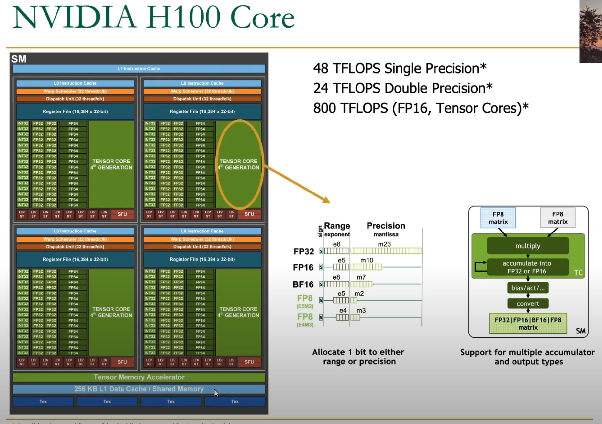

# GPU / CUDA Programming

[CUDA C++ Programming Guide](https://docs.nvidia.com/cuda/cuda-c-programming-guide/index.html)


[Programming Massively Parallel Processors (2022)](https://www.elsevier.com/books/programming-massively-parallel-processors/hwu/978-0-323-91231-0)

[How to Optimize a CUDA Matmul Kernel for cuBLAS-like Performance: a Worklog](https://siboehm.com/articles/22/CUDA-MMM)

[Programming Heterogeneous Computing Systems with GPUs and other Accelerators (Fall 2022)](https://safari.ethz.ch/projects_and_seminars/fall2022/doku.php?id=heterogeneous_systems)


```cpp

__global__ void kernel();  // define cuda kernel

cudaMalloc((void**)&d, bytes);
cudaMemCpy(dev, host, bytes, cudaMemcpyHostToDevice);

const unsigned int numBlocks = 8;
const unsigned int numThreads = 64;

kernel<<<numBlocks, numThreads>>>(args...);

cudaMemCpy(host, dev);

cudaFree(dev);


// #blocks and #threads


__shared__  // shared memory
__syncthreads();


cudaDeviceSynchronize();

```


### Kernel

```cpp

__global__ void my_kernel(float* x, float* y) {

    int idx = blockDim.x * blockIdx.x + threadIdx.x;
}

```


### 2D Blocks

Row major

`gridDim.x and gridDim.y`

```cpp
row = blockIdx.y * blockDim.y + threadIdx.y
col = blockIdx.x * blockDim.x + threadIdx.x
```

## GPU Architecture

[HetSys Course: Lecture 4: GPU Memory Hierarchy (Fall 2022)](https://www.youtube.com/watch?v=ynlGJ1utk4c)


### H100 (Nvidia Hopper Architecture)

[NVIDIA Hopper Architecture In-Depth](https://developer.nvidia.com/blog/nvidia-hopper-architecture-in-depth/)

####  H100 Thread Block Clusters

Thread blocks in the same cluster can sync and exchange data. Makes it possible to avoid having to write intermediate results to global memory


thread < thread block < thread block cluster < grid


GH100: 144 cores, 60MB L2 cache




TMA (Tensor Memory Accelerator) - reduces addressing overhead


Distributed Shared Memory


[Advanced Caches](https://www.youtube.com/watch?v=VxEGcEXiFj4)


