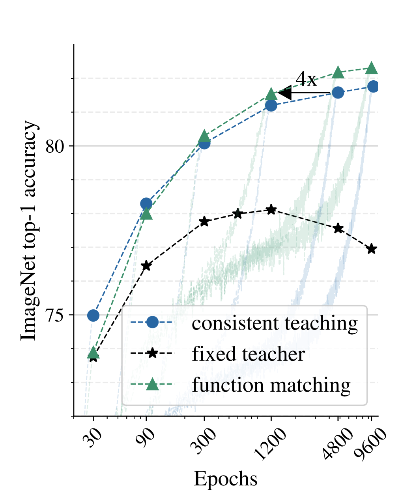
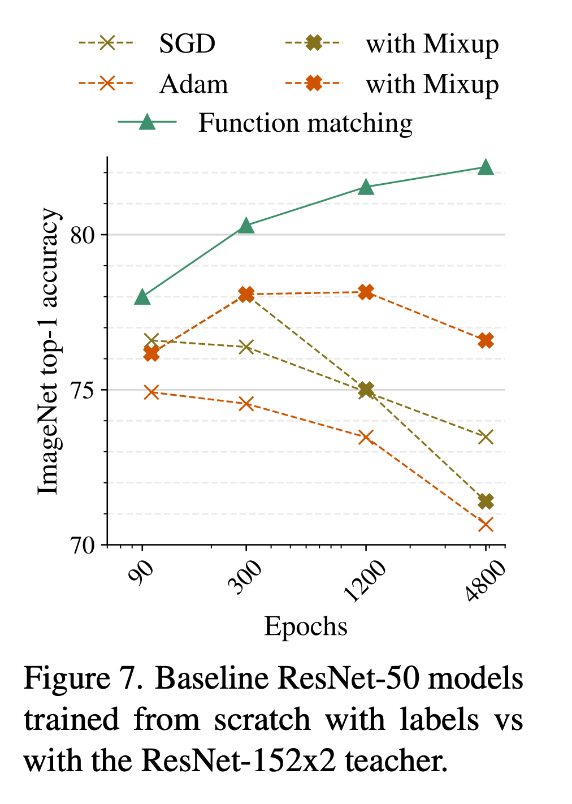

# Model Distillation and Transfer Learning

## Knowledge Distillation

Notes from [Knowledge distillation: A good teacher is patient and consistent](https://arxiv.org/abs/2106.05237):
> **Fixed teacher**  We explore several options where the teacher’s predictions are constant for a given image (precomputed target). The simplest (and worst) method is fix/rs, where the image is just resized to 2242px for both student and teacher. fix/cc follows a more common approach of using a fixed central crop for the teacher and a mild random crop for the student. fix/ic ens is a heavy data augmentation approach where the teacher’s prediction is the average of 1k incep- tion crops, which we verified to improve the teacher’s performance. The student also uses random inception crops. The two latter settings are similar to the input noise strategy from the “noisy student” paper 

> **Consistent teaching** In this approach, we randomly crop the image only once, either with mild random cropping (same/rc) or heavy inception crop (same/ic), and use this same crop for the input to both the student and the teacher.

> **Function matching** This approach extends consistent teaching, by expanding an input manifold of images through **mixup** (mix), and, again, providing consistent inputstothestudentandtheteacher. Forbrevity,we sometimes refer to this approach as “FunMatch”
ping (same/rc) or heavy inception crop (same/ic), and use this same crop for the input to both the student and the teacher.

> One needs patience along with consistency when doing distillation. Eventually, the teacher will be matched; this is true across various datasets of different scale.

### Function Matching

- [GitHub - Alibaba-MIIL/Solving_ImageNet: Official PyTorch implementation of  the paper: “Solving ImageNet: a Unified Scheme for Training any Backbone to Top Results” (2022)](https://github.com/Alibaba-MIIL/Solving_ImageNet)
- [Knowledge distillation: A good teacher is patient and consistent](https://arxiv.org/abs/2106.05237)
- [GitHub - google-research/big_transfer: Official repository for the “Big Transfer (BiT): General Visual Representation Learning” paper.](https://github.com/google-research/big_transfer)